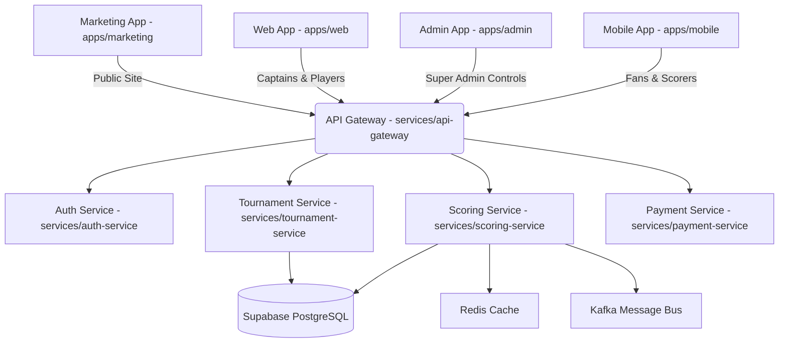
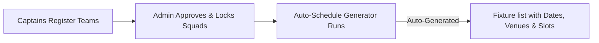

# Shakir Super League (SSL) — Product & Feature Guide
**Pakistan’s #1 Cricket Tournament & League Management Platform**  
*Built by Malik Tech (MTK) • Lead Developer: Muhammad Kashif*

---

## Table of Contents
1. [Platform Architecture & Applications](#1-platform-architecture--applications)
2. [User Roles & Management](#2-user-roles--management)
3. [Leagues & Tenant Management](#3-leagues--tenant-management)
4. [Tournament Formats & Match Auto-Scheduling](#4-tournament-formats--match-auto-scheduling)
5. [Live Ball-by-Ball Scoring System](#5-live-ball-by-ball-scoring-system)
6. [Interactive Match Analytics](#6-interactive-match-analytics)
7. [Scorecards & Career Statistics](#7-scorecards--career-statistics)
8. [Setup & Local Development Workflows](#8-setup--local-development-workflows)

---

## 1. Platform Architecture & Applications

The Shakir Super League platform is organized as a unified monorepo containing multiple frontend applications, shared packages, and specialized backend microservices.



### Frontend Applications

*   **Marketing App (`apps/marketing`)**: 
    *   *Purpose*: The landing site and public search portal (e.g., `ssl.cricket`).
    *   *Target Audience*: Prospective league owners, sponsors, and general public.
    *   *Key Features*: Pricing plans, feature breakdowns, public search directory of all active leagues.
*   **Web App (`apps/web`)**: 
    *   *Purpose*: Public-facing league portal (e.g., `yourleague.ssl.cricket`).
    *   *Target Audience*: Team captains, players, and local league fans.
    *   *Key Features*: Team registration wizard, squad updates, live match scorecards, bracket displays, and player profile pages.
*   **Admin App (`apps/admin`)**: 
    *   *Purpose*: Global dashboard and control center (e.g., `admin.ssl.cricket`).
    *   *Target Audience*: Super Admin (Muhammad Kashif) and Tenant League Admins.
    *   *Key Features*: Tenant approval logs, white-label configs, commission structures, global announcements, and system health status.
*   **Mobile App (`apps/mobile`)**: 
    *   *Purpose*: React Native/Expo app for iOS and Android.
    *   *Target Audience*: Fans wanting real-time notifications, and match scorers scoring matches directly at the ground.
    *   *Key Features*: Urdu localization, Right-to-Left (RTL) layouts, Push Notifications (Firebase), and live scores.

---

## 2. User Roles & Management

Authentication is managed via **Clerk** (with Supabase sync). Granular permissions are enforced using **Casbin RBAC** models.

| Role | Target Platform | Permissions & Scope |
| :--- | :--- | :--- |
| **Super Admin** *(Muhammad Kashif)* | Admin App | Global permissions. Access to platform revenue stats, tenant suspensions, system config, feature flags, and tenant user impersonation. |
| **League Admin** *(Tenant Owner)* | Admin App / Web App | Tenant-scoped permissions. Customize league branding (colors, logos, subdomain), approve team registrations, set entry fees, and assign matches to scorers. |
| **Team Captain** | Web App / Mobile App | Register team in a tournament, pay entry fees, manage team squad lists, select playing XI before matches start. |
| **Scorer** | Mobile App / Web App | Scorer role token. Access to ball-by-ball scorekeeper interface for assigned matches. Can enter balls, extra runs, wickets, and submit scorecard for review. |
| **Player / Fan** | Web App / Mobile App | Read-only access. View profile pages, track individual tournament statistics, view match history, and stream live games. |

---

## 3. Leagues & Tenant Management

SSL uses a **multi-tenant database schema architecture** in Supabase PostgreSQL, isolated using PostgreSQL Row-Level Security (RLS) policies.

> [!NOTE]
> All tables containing tenant data have a `tenant_id` column. RLS policies restrict SELECT, INSERT, UPDATE, and DELETE queries to match the authenticated tenant domain.

### Tenant Creation & Custom Domains
1. **League Setup**: A user visits the marketing page and creates a league. This creates a new record in the `tenants` table.
2. **Subdomains**: The league is immediately accessible on `[slug].ssl.cricket`.
3. **White-Labeling (Enterprise Plan)**:
    *   Allows linking custom domains (e.g., `www.karachicricket.com`).
    *   Includes custom theme configuration (primary HSL color tokens, dark mode preferences, and header logos).
    *   Option to hide the "Powered by SSL" footer logo.

---

## 4. Tournament Formats & Match Auto-Scheduling

The **Tournament Service** (`services/tournament-service`) structures league schedules dynamically.

### Supported Tournament Formats
*   **Round Robin / Group Stage**: Teams are divided into groups. Each team plays every other team in their group once or twice.
*   **Single/Double Elimination (Knockout)**: Auto-generated tournament brackets (Quarterfinals, Semifinals, Finals) with seeding overrides.
*   **Hybrid League**: Group stages followed by knockout brackets.



### Advanced Rules
*   **Net Run Rate (NRR)**: Calculated automatically on every match result using the formula:
    $$\text{NRR} = \left( \frac{\text{Runs Scored}}{\text{Overs Faced}} \right) - \left( \frac{\text{Runs Conceded}}{\text{Overs Bowled}} \right)$$
*   **DLS (Duckworth-Lewis-Stern) Calculator**: Calculates revised targets during weather delays based on resources (wickets lost, overs remaining).
*   **Super Over Mode**: Automatically triggers if a knockout match ends in a tie.

---

## 5. Live Ball-by-Ball Scoring System

The live scoring workflow is powered by the NestJS **Scoring Service** (`services/scoring-service`) using WebSockets for real-time client updates and Redis for rapid state operations.

### Scoring Actions
*   **Standard Deliveries**: Runs (0, 1, 2, 3, 4, 6), dot balls, batsman strikes (auto-swaps striker and non-striker on odd runs or over completions).
*   **Extras**: 
    *   *Wides*: (default +1 run, doesn't count towards over balls, auto-striker swap disabled).
    *   *No Balls*: (default +1 run + Free Hit indicator triggered, doesn't count towards over balls).
    *   *Byes & Leg Byes*: (scored as runs but attributed to team extras, not batsman).
*   **Wickets**: Bowled, Caught, Caught Behind, Run Out, Stumped, LBW, Hit Wicket, Retired. Handles striker determination for next batsman.

> [!TIP]
> **Offline-First Mode**: If a scorer loses connection at a cricket ground, scoring actions are cached in IndexedDB (Web) or SecureStore (Mobile). Once connectivity is restored, they are merged sequentially with the backend database.

---

## 6. Interactive Match Analytics

Live score data feeds into interactive visualizations displayed on the Web and Mobile apps:

### 1. Wagon Wheel
Calculates and plots the direction of every scoring shot based on scorer coordinates input.
*   Divided into 8 standard cricket zones (Off Side, Leg Side, Cover, Mid-Wicket, etc.).
*   Color-coded lines: Singles (grey), Fours (green), Sixes (red).

### 2. Manhattan Graph
Shows the runs scored in each over of the innings.
*   Vertical bars display runs.
*   Dots overlay wickets lost during that specific over.

### 3. Worm Chart
Displays a comparative line graph of cumulative runs scored by both teams across the duration of the match.
*   Allows fans to visualize run-rate changes and comparative positions of both teams.

---

## 7. Scorecards & Career Statistics

All statistics are generated cleanly using three separate scorecard tables synced in real-time.

```
                  ┌───────────────────────┐
                  │  batting_scorecards   │
                  └───────────────────────┘
                              │
                  ┌───────────────────────┐
                  │  bowling_scorecards   │
                  └───────────────────────┘
                              │
                  ┌───────────────────────┐
                  │  fielding_scorecards  │
                  └───────────────────────┘
```

*   **Batting Scorecards**: Records runs, balls faced, fours, sixes, minutes batted, and dismissal status (bowler, fielder, dismissal type).
*   **Bowling Scorecards**: Records overs, balls bowled, maidens, runs conceded, wickets, wides, no-balls, and economy rate.
*   **Fielding Scorecards**: Tracks catches, stumpings, run-outs, and direct hits.

### Career Statistics (Materialized Views)
To prevent heavy query operations across millions of historical ball logs, all-time career statistics are compiled in a materialized view called `player_all_time_stats`:

```sql
CREATE MATERIALIZED VIEW player_all_time_stats AS
SELECT 
    tenant_id,
    player_id,
    sum(matches_played) as total_matches,
    sum(runs_scored) as total_runs,
    sum(balls_faced) as total_balls_faced,
    sum(fours) as total_fours,
    sum(sixes) as total_sixes,
    max(highest_score) as highest_score,
    sum(fifties) as total_fifties,
    sum(hundreds) as total_hundreds,
    sum(wickets_taken) as total_wickets,
    sum(balls_bowled) as total_balls_bowled,
    sum(runs_conceded) as total_runs_conceded,
    sum(catches) as total_catches,
    sum(run_outs) as total_run_outs,
    sum(stumpings) as total_stumpings,
    CASE 
        WHEN sum(balls_faced) > 0 THEN ROUND((sum(runs_scored)::decimal / sum(balls_faced)) * 100, 2)
        ELSE 0 
    END as career_strike_rate
FROM player_season_stats
GROUP BY tenant_id, player_id;
```

> [!IMPORTANT]
> The database triggers an auto-refresh of this materialized view concurrently (`REFRESH MATERIALIZED VIEW CONCURRENTLY player_all_time_stats`) whenever a match scorecard is finalized or modified in `player_season_stats`.

---

## 8. Setup & Local Development Workflows

To run the full suite of frontend applications and backend services locally, follow these commands:

```bash
# 1. Install dependencies
pnpm install

# 2. Build shared packages (ui, database, etc.)
pnpm run build

# 3. Apply database migrations
node packages/database/run-migrations.js

# 4. Launch all microservices & apps in dev mode
pnpm run dev
```

### Port Mapping Summary
*   **Marketing Landing Site**: `http://localhost:3000`
*   **Main Web Application**: `http://localhost:3001`
*   **Super Admin Control Panel**: `http://localhost:3002`
*   **API Gateway**: `http://localhost:4000`
*   **Metro Expo Bundler (Mobile)**: `http://localhost:8081`
